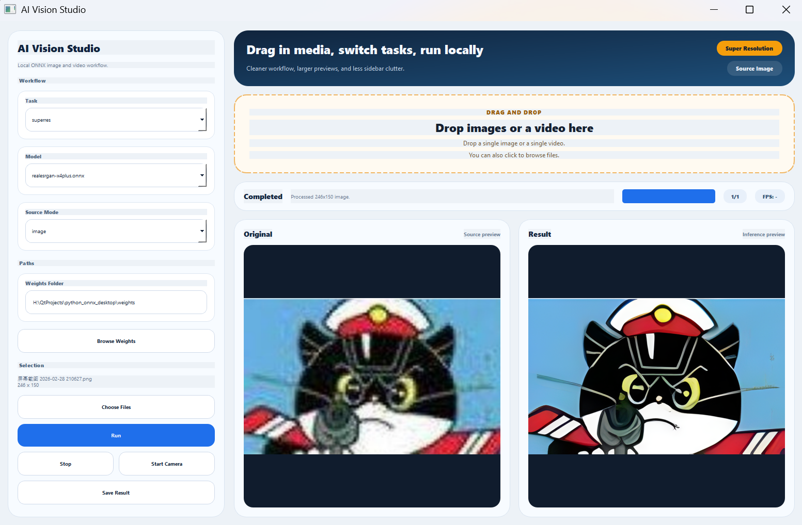
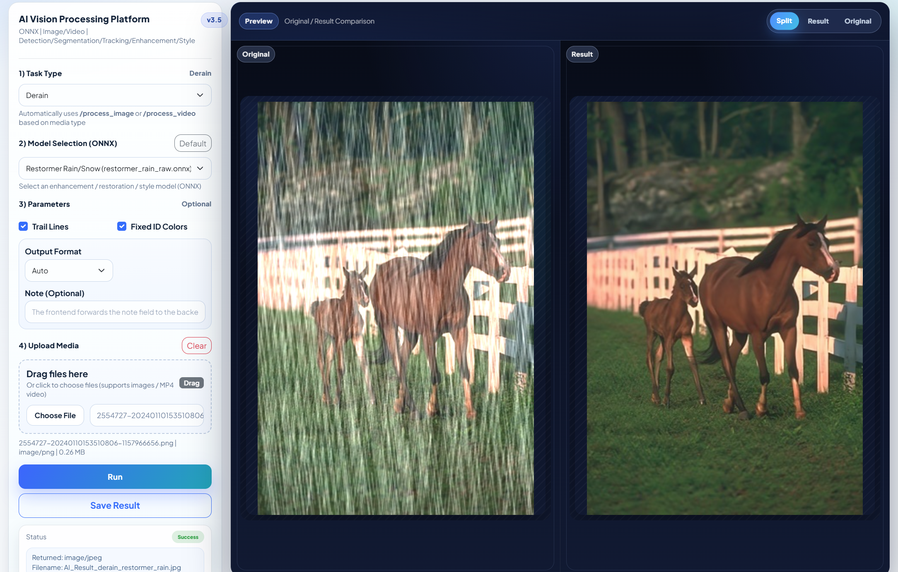
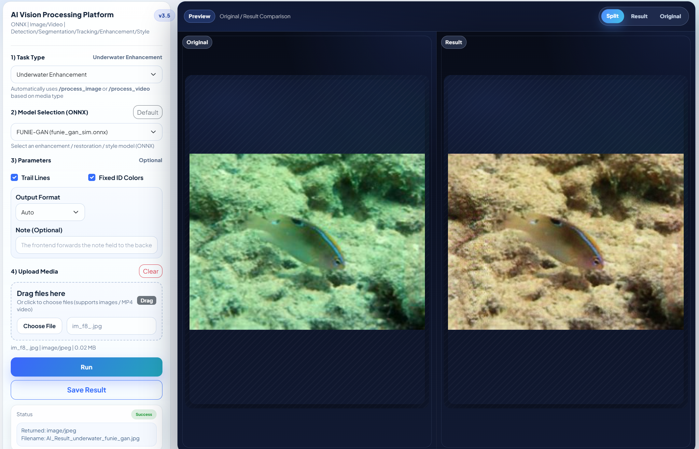
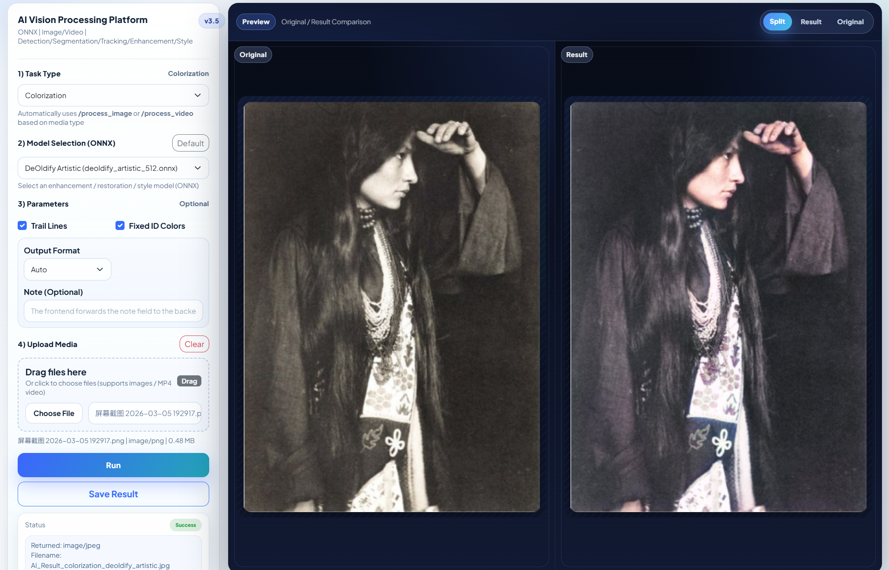
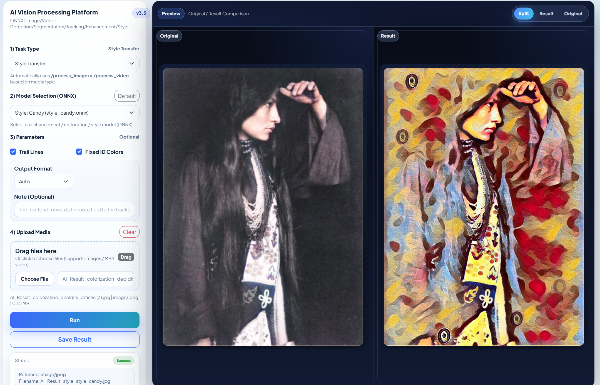
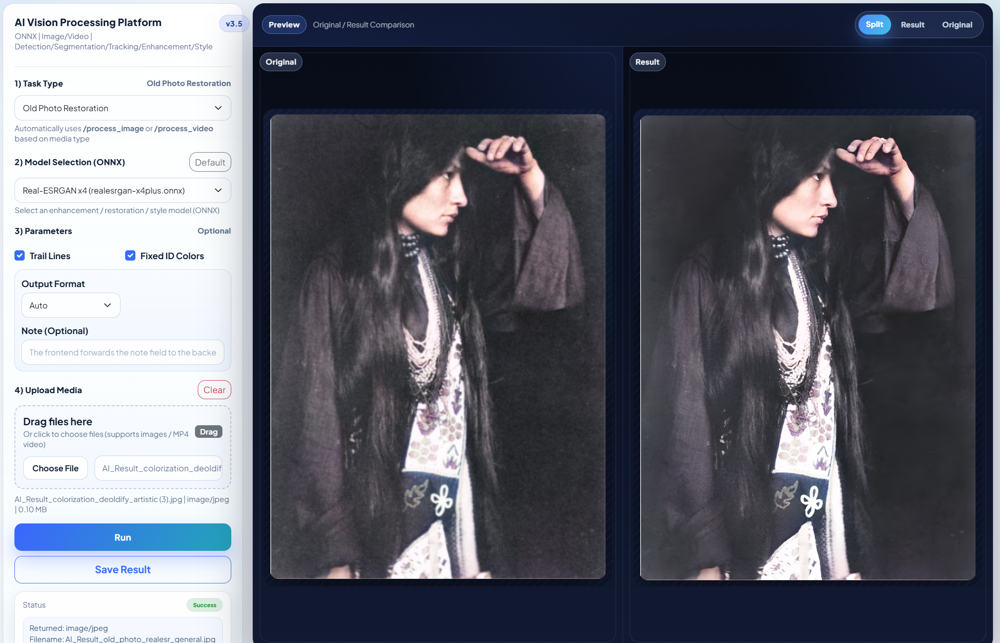

# Python ONNX Desktop

Local PyQt5 desktop app for ONNX-based image, video, and camera inference.

## Overview

This project is a pure Python desktop frontend around ONNX Runtime and OpenCV. It focuses on local media workflows:

- single image inference
- single video inference
- live camera inference for YOLO tasks
- side-by-side original/result preview
- drag-and-drop input
- local save/export for processed images and videos

The current UI is implemented with PyQt5, and the inference backend is in `app/inference.py`.

## Interface



## Supported Tasks

Image / video tasks:

- `superres`
- `dehaze`
- `derain`
- `desnow`
- `underwater`
- `old_photo`
- `colorization`
- `style`
- `detect`
- `segment`
- `track`

Camera mode supports YOLO tasks only:

- `detect`
- `segment`
- `track`

Default startup task is `track`.

## Demo Images

| Super Resolution | Dehaze |
|---|---|
|  |  |

| Derain | Underwater |
|---|---|
|  |  |

| Colorization | Style Transfer |
|---|---|
|  |  |

| DeOldify |
|---|
|  |

## Features

- PyQt5 desktop UI
- ONNX Runtime inference with automatic CUDA provider selection when available
- OpenCV-based image, video, and camera handling
- drag-and-drop for a single image or a single video
- automatic replay of processed videos in the preview area after inference
- `Save Result` for images and `Save Video` for processed videos
- Windows-friendly image loading for non-ASCII paths

## Requirements

- Python 3.9+
- ONNX model files under `weights/`

Install dependencies:

```powershell
python -m pip install -r requirements.txt
```

## Run

From the project root:

```powershell
python main.py
```

Or with your explicit interpreter:

```powershell
E:/conda/envs_dirs/baseline/python.exe h:/QtProjects/python_onnx_desktop/main.py
```

## Project Structure

```text
.
|-- app/
|   |-- constants.py
|   |-- gui.py
|   |-- inference.py
|   `-- __init__.py
|-- figs/
|-- weights/
|-- main.py
|-- README.md
`-- requirements.txt
```

## Notes

- Default weights directory is `weights/` under the repository root.
- `desnow` currently reuses the available Restormer weight and is effectively a placeholder mode.
- Running `app/inference.py` directly is supported for import/debug purposes, but the normal entry point is `main.py`.
- This repository currently contains the desktop Python app only; the old C++ and web README content no longer applies here.
